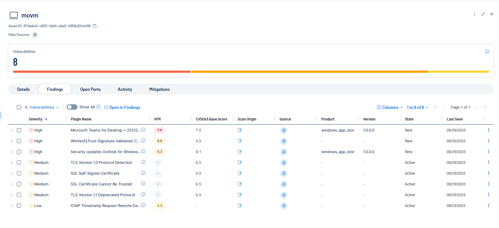
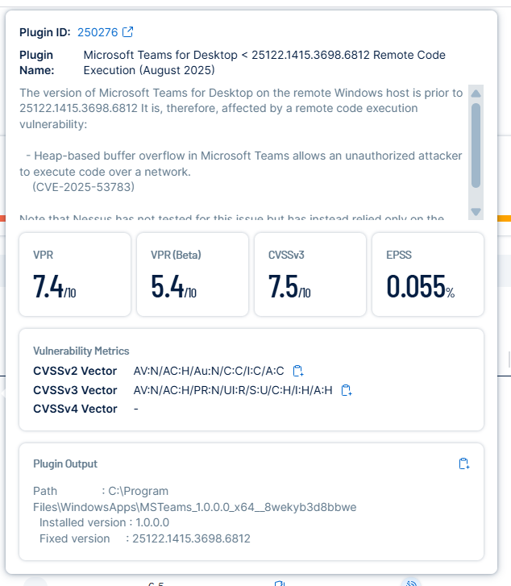

# STIG – Microsoft Teams for Desktop < 25122.1415.3698.6812 Remote Code Execution (Plugin ID: 250276)

## Before
- **Finding:** Microsoft Teams for Desktop is outdated (version < 25122.1415.3698.6812), affected by a Remote Code Execution (RCE) vulnerability.  
- **Risk:** Attackers can exploit a heap-based buffer overflow to execute arbitrary code remotely.  
- **Evidence:**  
    

---

## Remediation
1. Update Microsoft Teams to the fixed version `25122.1415.3698.6812` or later.  
2. Verify installation by checking the Teams version (`Help > About > Version` or via `Programs and Features`).  
3. Reboot the system if required.  
4. Perform a Tenable rescan to validate the vulnerability is resolved.  

---

## After
Microsoft Teams successfully updated to version 25122.1415.3698.6812 or later, mitigating the RCE vulnerability.

Evidence (to be included):

Teams-After-Details.png

Teams-After-Tenable-Rescan.png 

